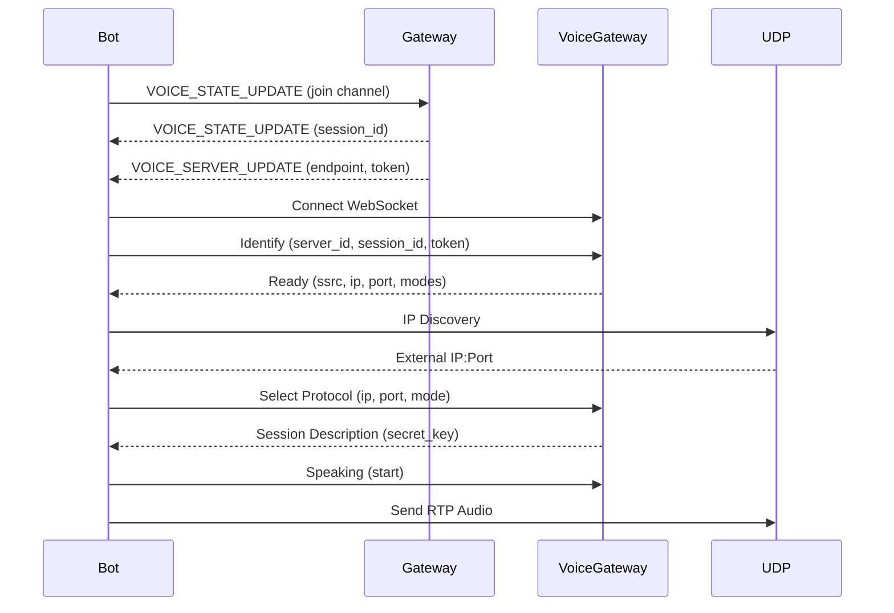
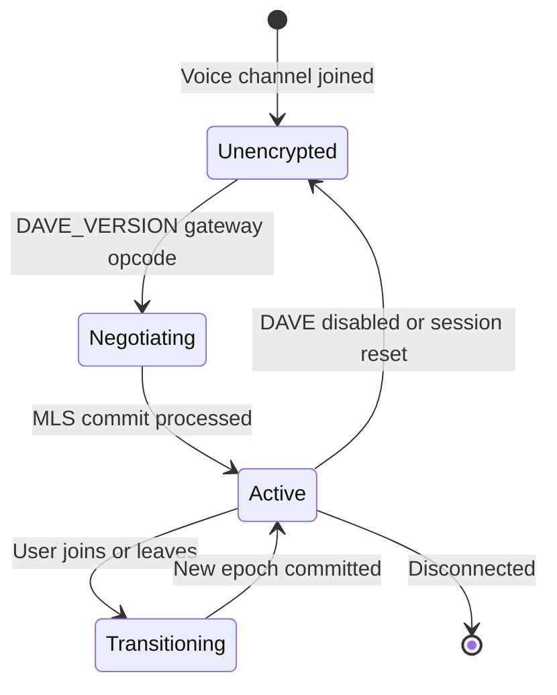

# Voice Architecture

DisCatSharp.Voice is the voice subsystem for DisCatSharp. It provides full support for Discord voice channels including:

- **Voice gateway** — WebSocket-based signaling for voice session management
- **UDP media transport** — low-latency audio transport over UDP
- **DAVE encryption** — Discord's end-to-end encryption protocol for voice

---

## Connection Lifecycle

When a bot joins a voice channel, the following sequence occurs:

---

## DAVE — Discord's E2EE Voice Encryption

DAVE (Discord Audio/Video Encryption) is Discord's end-to-end encryption protocol for voice channels. It is built on top of the [MLS (Messaging Layer Security)](https://www.rfc-editor.org/rfc/rfc9420) standard.

### Why DAVE?

Traditional voice encryption in Discord protects data in transit (between client and server) but the server can observe audio. DAVE adds end-to-end encryption so audio is encrypted between clients — the Discord server cannot decrypt it.

### How DAVE Works

1. **Group key agreement via MLS** — When users join an encrypted voice channel, they participate in an MLS group key exchange. Each participant gets a key package (a signed public key).

2. **Epoch-based ratchet keys** — After each MLS commit (triggered by join/leave), a new epoch begins. Each epoch derives per-sender ratchet keys.

3. **Per-frame AES-128-GCM encryption** — Each RTP audio frame is encrypted using a key derived from the sender's current ratchet generation. The nonce includes the sender's SSRC and frame counter to prevent replay attacks.

4. **Forward secrecy** — Old ratchet keys are deleted after rotation, protecting past sessions even if a future key is compromised.

### DAVE Session State Machine

---

## Packet Encryption Pipeline

### Sending

Each outgoing RTP frame passes through:

1. **Opus encoder** — PCM audio is encoded to Opus
2. **RTP framing** — Sequence number, timestamp, SSRC assigned
3. **DAVE per-frame encryption** — AES-128-GCM inner encryption (end-to-end)
4. **Sodium transport encryption** — Outer XSalsa20-Poly1305 (client-to-server transport)
5. **UDP send**

### Receiving

Each incoming RTP frame passes through:

1. **UDP receive**
2. **RTP header parse** — Extract SSRC, sequence, timestamp
3. **Sodium transport decryption** — Strip outer transport encryption
4. **RFC 5285 extension strip** — Remove RTP extension header if present
5. **DAVE per-frame decryption** — AES-128-GCM per-sender decryption
6. **Opus decode** — Decode to PCM
7. **VoiceReceived event**

---

## libdave Integration

DisCatSharp.Voice uses `libdave` — Discord's official C++ library implementing the DAVE protocol. It is included as a prebuilt native binary in `DisCatSharp.Voice.Natives`.

`libdave` is responsible for:
- MLS group operations (key packages, proposals, commits, welcomes)
- Per-sender ratchet key derivation
- AES-128-GCM frame encryption and decryption
- Nonce management and replay protection

DisCatSharp wraps `libdave` via P/Invoke in:
- `LibDaveEncryptor` — per-connection encryptor
- `LibDaveDecryptor` — per-user decryptor
- `LibDaveMlsProvider` — MLS group operations

---

## Security Properties

| Property | Value |
|---|---|
| Group key agreement | MLS (RFC 9420) |
| Frame encryption | AES-128-GCM |
| Nonce scheme | SSRC + frame counter |
| Forward secrecy | Yes (ratchet rotation per epoch) |
| Break-in recovery | Yes (new epoch after each membership change) |
| Replay protection | Yes (nonce includes counter) |

---

## See Also

- [Voice Prerequisites](xref:modules_audio_voice_prerequisites)
- [Transmitting Audio](xref:modules_audio_voice_transmit)
- [Receiving Audio](xref:modules_audio_voice_receive)
- [Migration Guide](xref:modules_audio_voice_migration)
