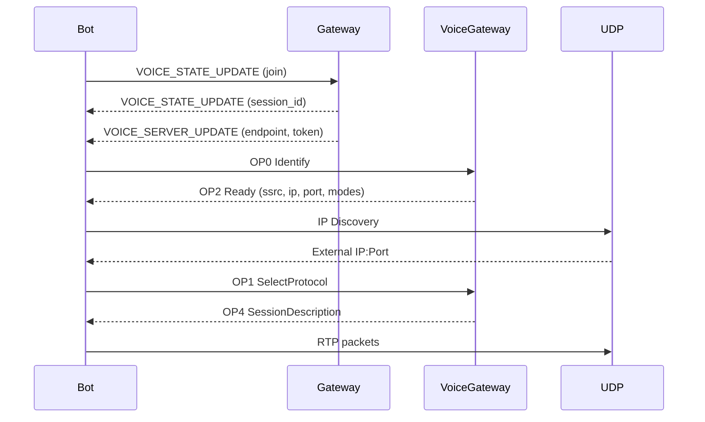
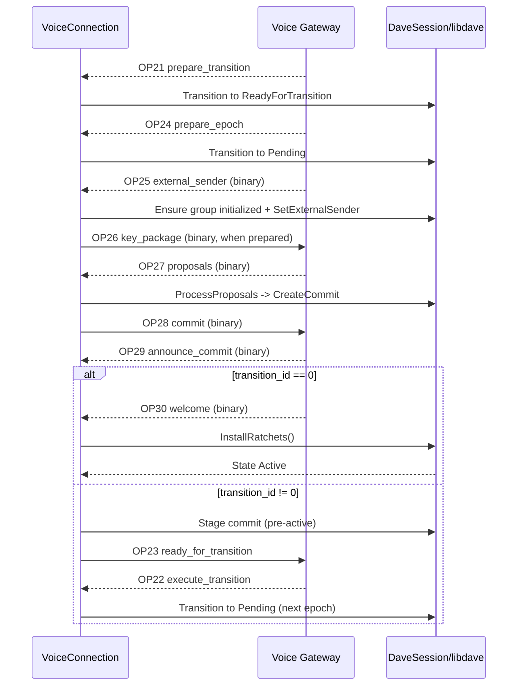
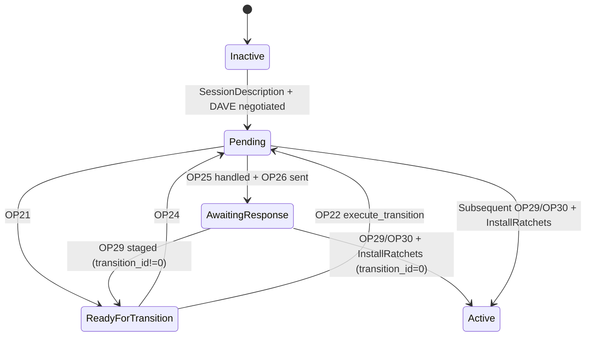
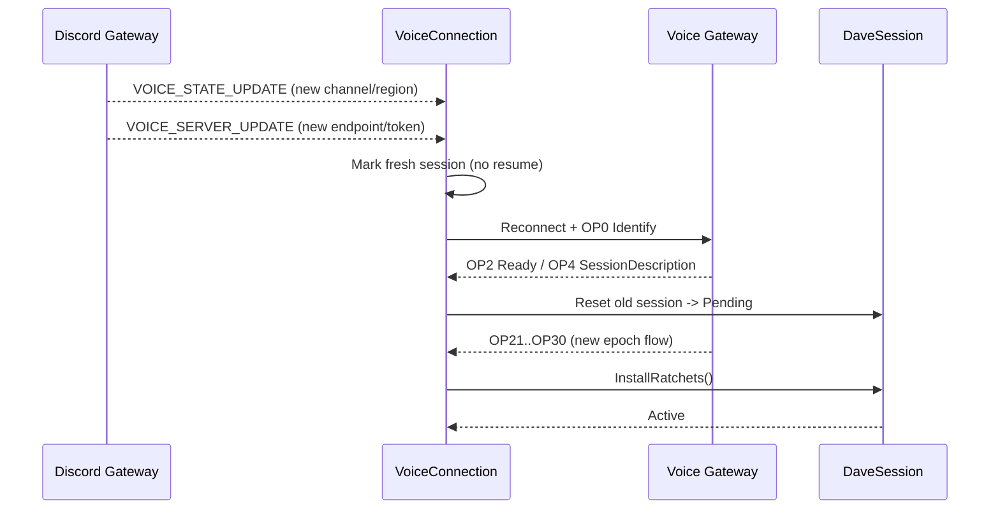
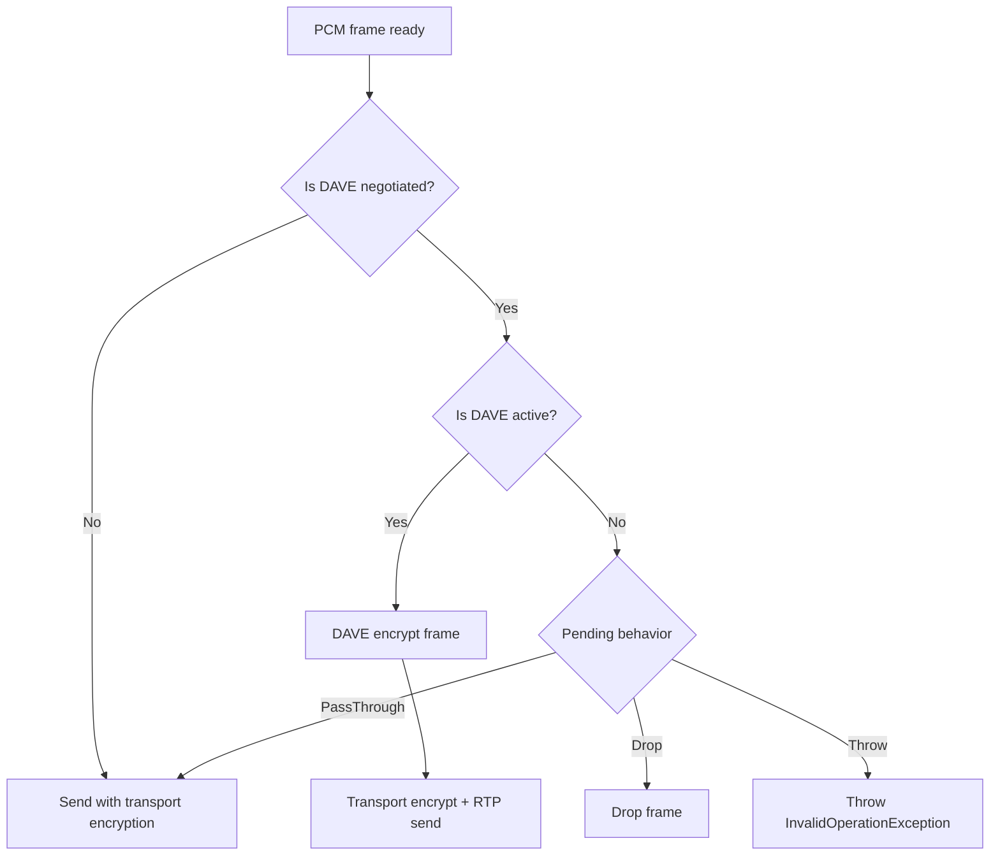

# Voice Architecture

`DisCatSharp.Voice` combines gateway signaling, UDP media transport, Opus, Discord transport encryption, and optional DAVE E2EE.

## Connection Lifecycle

## Media Pipeline

### Send path

1. PCM input
2. Opus encode
3. RTP header encode
4. DAVE frame encryption (if active)
5. Discord transport encryption (AEAD/XSalsa mode)
6. UDP send

### Receive path

1. UDP receive
2. RTP header parse
3. Discord transport decryption
4. DAVE frame decryption (if active)
5. RTP extension strip (RFC 5285)
6. Opus decode
7. `VoiceReceived` event dispatch

## DAVE Handshake Overview

Typical gateway flow:

- OP21 `prepare_transition`
- OP22 `execute_transition` (used to execute staged non-zero transitions)
- OP24 `prepare_epoch`
- OP25 binary `external_sender`
- OP26 binary key package (client send)
- OP27 binary proposals
- OP28 binary commit (client send)
- OP29 binary announce_commit
- OP30 binary welcome

`VoiceConnection` emits:

- `[DAVE FLOW] OPxx received/sent`
- `[DAVE FSM] {OldState} -> {NewState} via {Handler}`

## DAVE Join Workflow

When the bot joins an encrypted channel, DAVE activation is a multi-step MLS flow.

### Join state progression

If no proposals arrive (for example, bot alone in channel), DAVE can remain `Pending`/`AwaitingResponse` until another participant triggers group activity.

## DAVE Move / Reconnect Workflow

Moving the bot (or forced region move) triggers voice gateway rebind and DAVE re-negotiation.

Key rule: when endpoint/channel context changes, perform a fresh identify path for the new server context and complete a new DAVE handshake.

## Playback Workflow vs DAVE State

Outbound audio behavior is controlled by state and `DavePendingAudioBehavior`.

## Public DAVE States

`VoiceConnection.DaveState` maps to:

- `NotNegotiated`
- `Inactive`
- `Pending`
- `AwaitingResponse`
- `ReadyForTransition`
- `Active`
- `Downgrading`

## Runtime Signals

Use these for application-level gating and diagnostics:

- `IsDaveNegotiated`
- `IsDaveActive`
- `IsE2eeUsableForSend`
- `IsE2eeUsableForReceive`
- `WaitForDaveActiveAsync(...)`
- `EnableDebugLogging` (per connection toggle)
- `DaveStateChanged` event
- `DaveOpcodeObserved` event

## See Also

- [Voice Overview](xref:modules_audio_voice)
- [Voice Events](xref:modules_audio_voice_events)
- [Voice Prerequisites](xref:modules_audio_voice_prerequisites)
- [Transmitting Audio](xref:modules_audio_voice_transmit)
- [Receiving Audio](xref:modules_audio_voice_receive)
