# Voice Architecture

`DisCatSharp.Voice` combines Discord gateway signaling, voice-gateway signaling, UDP media transport, Opus, Discord transport encryption, and DAVE end-to-end encryption (E2EE).

This article describes the DAVE 1.1.4 transition model. The important rule is that DAVE control-plane state and currently executing media transforms are related, but are not the same state.

## Connection Lifecycle

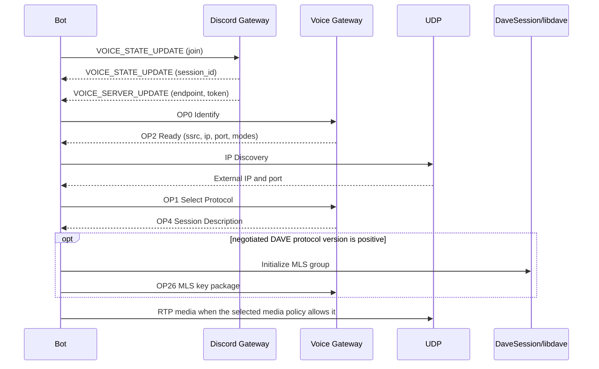
```mermaid
sequenceDiagram
    participant Bot
    participant Gateway as Discord Gateway
    participant VoiceGateway as Voice Gateway
    participant UDP
    participant DAVE as DaveSession/libdave

    Bot->>Gateway: VOICE_STATE_UPDATE (join)
    Gateway-->>Bot: VOICE_STATE_UPDATE (session_id)
    Gateway-->>Bot: VOICE_SERVER_UPDATE (endpoint, token)
    Bot->>VoiceGateway: OP0 Identify
    VoiceGateway-->>Bot: OP2 Ready (ssrc, ip, port, modes)
    Bot->>UDP: IP Discovery
    UDP-->>Bot: External IP and port
    Bot->>VoiceGateway: OP1 Select Protocol
    VoiceGateway-->>Bot: OP4 Session Description
    opt negotiated DAVE protocol version is positive
        Bot->>DAVE: Initialize MLS group
        Bot->>VoiceGateway: OP26 MLS key package
    end
    Bot->>UDP: RTP media when the selected media policy allows it
```

A protocol version of `0` creates a protocol-0 DAVE coordinator in passthrough mode. This lets the same connection upgrade later without waiting for another OP4.

## Media Pipeline

Both PCM and pre-encoded Opus sources pass through the same RTP, DAVE, and transport-encryption stages.

### Send path

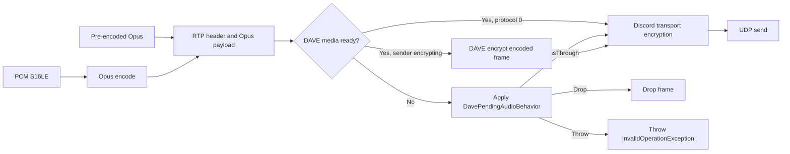
```mermaid
flowchart LR
    PCM["PCM S16LE"] --> Encode["Opus encode"]
    External["Pre-encoded Opus"] --> Frame["RTP header and Opus payload"]
    Encode --> Frame
    Frame --> Gate{"DAVE media ready?"}
    Gate -->|"No"| Policy["Apply DavePendingAudioBehavior"]
    Gate -->|"Yes, sender encrypting"| DaveEncrypt["DAVE encrypt encoded frame"]
    Gate -->|"Yes, protocol 0"| Transport["Discord transport encryption"]
    Policy -->|"PassThrough"| Transport
    Policy -->|"Drop"| Dropped["Drop frame"]
    Policy -->|"Throw"| Error["Throw InvalidOperationException"]
    DaveEncrypt --> Transport
    Transport --> UDP["UDP send"]
```

The RTP header is authenticated by the selected Discord transport mode. DAVE transforms the encoded media payload before Discord transport encryption is applied.

### Receive path

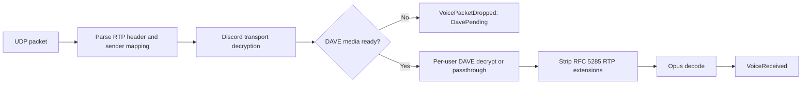
```mermaid
flowchart LR
    UDP["UDP packet"] --> RTP["Parse RTP header and sender mapping"]
    RTP --> Transport["Discord transport decryption"]
    Transport --> Gate{"DAVE media ready?"}
    Gate -->|"No"| Drop["VoicePacketDropped: DavePending"]
    Gate -->|"Yes"| Dave["Per-user DAVE decrypt or passthrough"]
    Dave --> Extensions["Strip RFC 5285 RTP extensions"]
    Extensions --> Decode["Opus decode"]
    Decode --> Event["VoiceReceived"]
```

Incoming DAVE frames are selected by Discord user ID, not only by SSRC. A missing SSRC-to-user mapping or missing per-user decryptor is reported through `VoicePacketDropped`.

## Control Plane and Media Plane

The public FSM describes negotiation work. Media properties describe what the connection can do right now.

| Surface | Meaning |
| --- | --- |
| `DaveState` | Current DAVE control-plane state |
| `DaveProtocolVersion` | Protocol version used by the currently executing sender transform |
| `IsDaveNegotiated` | A DAVE coordinator exists, including protocol-0 passthrough |
| `IsDaveActive` | The currently executing sender transform is applying DAVE encryption |
| `IsE2eeUsableForSend` | Outbound media can be processed under the current transform and pending-audio policy |
| `IsE2eeUsableForReceive` | Inbound media can currently be processed by the executing receive mode |

For an established member, `IsDaveActive` remains `true` while `DaveState` is `ReadyForTransition` or `Downgrading`: receivers have prepared the next mode, but the sender continues using the old epoch until OP22. After a protocol-0 downgrade, `DaveState` is `Inactive` and `IsDaveActive` is `false`, while both media-usability properties remain `true` because plaintext passthrough is the executing mode.

## DAVE Opcode Responsibilities

| Opcode | Direction | Representation | Responsibility |
| --- | --- | --- | --- |
| OP11 `clients_connect` | Server → client | JSON | Replaces the recognized participant set |
| OP13 `client_disconnect` | Server → client | JSON | Removes the participant and its decryptor |
| OP21 `prepare_transition` | Server → client | JSON | Prepares receiver transforms for a transition ID and protocol version |
| OP22 `execute_transition` | Server → client | JSON | Executes one staged transition on the local sender only |
| OP23 `ready_for_transition` | Client → server | JSON | Reports that receiver transforms are ready for a nonzero transition ID |
| OP24 `prepare_epoch` | Server → client | JSON | Announces `epoch` and `protocol_version`; epoch `1` reinitializes MLS and produces OP26 |
| OP25 `external_sender` | Server → client | Binary | Installs the MLS external sender package |
| OP26 `key_package` | Client → server | Binary | Supplies a fresh MLS key package |
| OP27 `proposals` | Server → client | Binary | Supplies MLS proposals for validation and commit creation |
| OP28 `commit_welcome` | Client → server | Binary | Supplies a commit and, when required, a Welcome |
| OP29 `announce_commit` | Server → client | Binary | Carries a transition-ID prefix and an MLS commit |
| OP30 `welcome` | Server → client | Binary | Carries a transition-ID prefix and an MLS Welcome |
| OP31 `invalid_commit_welcome` | Client → server | JSON | Reports the exact transition ID of a rejected OP29 or OP30 |

OP23 is sent after successful receiver preparation and before OP22. OP22 never receives an OP23 acknowledgement.

## Initial Group Creation and Member Join

OP29 and OP30 are two recipient perspectives on the same epoch transition: established members process the announced commit, while a pending member processes its Welcome.

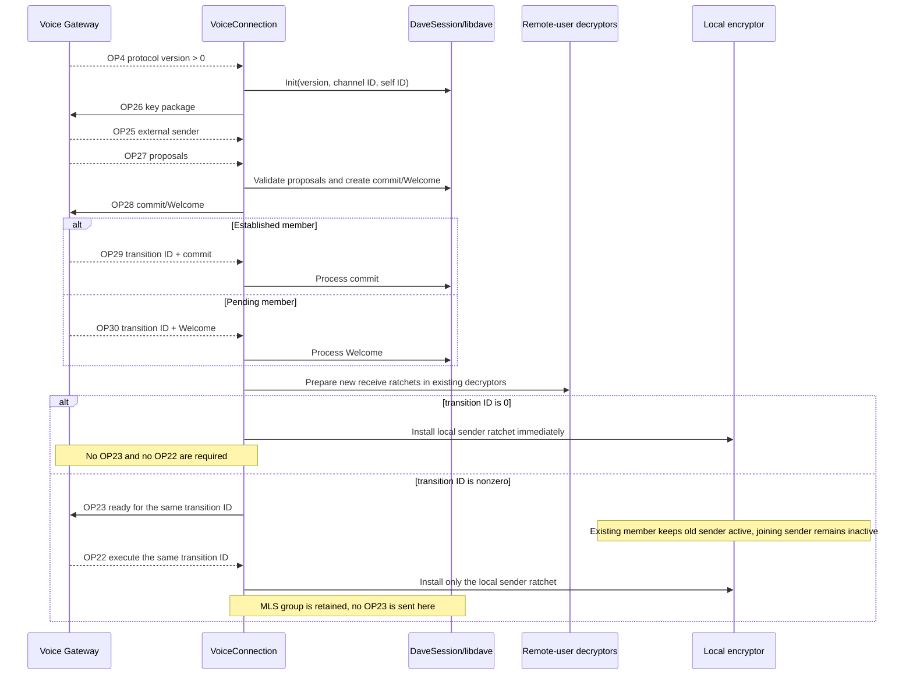
```mermaid
sequenceDiagram
    participant VG as Voice Gateway
    participant VC as VoiceConnection
    participant MLS as DaveSession/libdave
    participant RX as Remote-user decryptors
    participant TX as Local encryptor

    VG-->>VC: OP4 protocol version > 0
    VC->>MLS: Init(version, channel ID, self ID)
    VC->>VG: OP26 key package
    VG-->>VC: OP25 external sender
    VG-->>VC: OP27 proposals
    VC->>MLS: Validate proposals and create commit/Welcome
    VC->>VG: OP28 commit/Welcome

    alt Established member
        VG-->>VC: OP29 transition ID + commit
        VC->>MLS: Process commit
    else Pending member
        VG-->>VC: OP30 transition ID + Welcome
        VC->>MLS: Process Welcome
    end

    VC->>RX: Prepare new receive ratchets in existing decryptors
    alt transition ID is 0
        VC->>TX: Install local sender ratchet immediately
        Note over VC,VG: No OP23 and no OP22 are required
    else transition ID is nonzero
        VC->>VG: OP23 ready for the same transition ID
        Note over TX: Existing member keeps old sender active, joining sender remains inactive
        VG-->>VC: OP22 execute the same transition ID
        VC->>TX: Install only the local sender ratchet
    Note over VC,MLS: MLS group is retained, no OP23 is sent here
    end
```

An unknown or duplicate OP22 transition ID is ignored with a warning. It does not change protocol version, FSM state, MLS state, or media ratchets.

## Initialization Transition ID 0

Transition ID `0` is reserved for initialization and reinitialization. OP21, OP29, or OP30 with ID `0` prepares receivers and immediately switches the local sender. DisCatSharp does not stage the ID or send OP23.

This is also used by the sole-member reset flow:

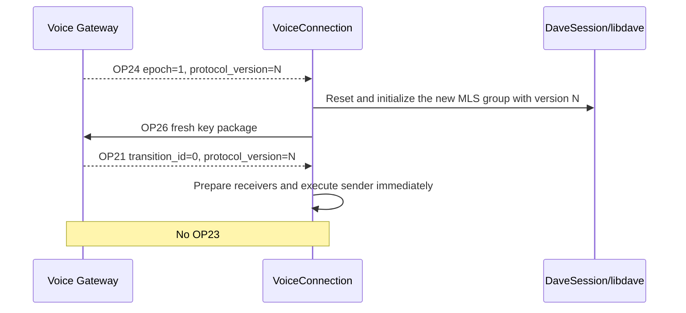
```mermaid
sequenceDiagram
    participant VG as Voice Gateway
    participant VC as VoiceConnection
    participant MLS as DaveSession/libdave

    VG-->>VC: OP24 epoch=1, protocol_version=N
    VC->>MLS: Reset and initialize the new MLS group with version N
    VC->>VG: OP26 fresh key package
    VG-->>VC: OP21 transition_id=0, protocol_version=N
    VC->>VC: Prepare receivers and execute sender immediately
    Note over VC,VG: No OP23
```

OP24 does not contain a transition ID and does not create a staged transition by itself.

## Established Epoch Transition

For a nonzero OP29 transition, receiving moves first and sending moves later:

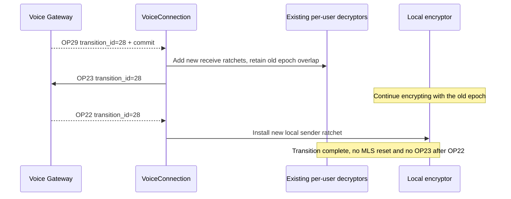
```mermaid
sequenceDiagram
    participant VG as Voice Gateway
    participant VC as VoiceConnection
    participant RX as Existing per-user decryptors
    participant TX as Local encryptor

    VG-->>VC: OP29 transition_id=28 + commit
    VC->>RX: Add new receive ratchets, retain old epoch overlap
    VC->>VG: OP23 transition_id=28
    Note over TX: Continue encrypting with the old epoch
    VG-->>VC: OP22 transition_id=28
    VC->>TX: Install new local sender ratchet
    Note over RX,TX: Transition complete, no MLS reset and no OP23 after OP22
```

The same staging rule applies to a nonzero OP30 Welcome. A newly joining member has receiver ratchets prepared after OP30 but does not activate its local sender until matching OP22.

## Downgrade to Protocol 0

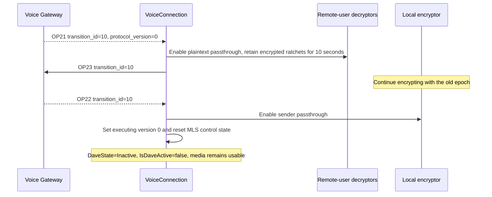
```mermaid
sequenceDiagram
    participant VG as Voice Gateway
    participant VC as VoiceConnection
    participant RX as Remote-user decryptors
    participant TX as Local encryptor

    VG-->>VC: OP21 transition_id=10, protocol_version=0
    VC->>RX: Enable plaintext passthrough, retain encrypted ratchets for 10 seconds
    VC->>VG: OP23 transition_id=10
    Note over TX: Continue encrypting with the old epoch
    VG-->>VC: OP22 transition_id=10
    VC->>TX: Enable sender passthrough
    VC->>VC: Set executing version 0 and reset MLS control state
    Note over VC: DaveState=Inactive, IsDaveActive=false, media remains usable
```

Preparing a downgrade does not pause old-epoch audio. `DavePendingAudioBehavior.Drop` and `Throw` apply only when media is genuinely unusable, not merely because the FSM says `Downgrading`.

## Invalid Commit or Welcome Recovery

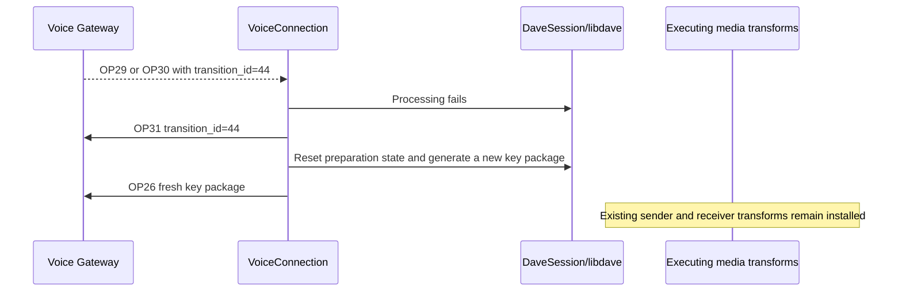
```mermaid
sequenceDiagram
    participant VG as Voice Gateway
    participant VC as VoiceConnection
    participant MLS as DaveSession/libdave
    participant Media as Executing media transforms

    VG-->>VC: OP29 or OP30 with transition_id=44
    VC->>MLS: Processing fails
    VC->>VG: OP31 transition_id=44
    VC->>MLS: Reset preparation state and generate a new key package
    VC->>VG: OP26 fresh key package
    Note over Media: Existing sender and receiver transforms remain installed
```

OP31 is client-to-server recovery. DisCatSharp retains the currently executing media transforms until a later valid transition replaces them.

## Public DAVE State Model

The following is a representative control-plane graph, not a media-availability graph:

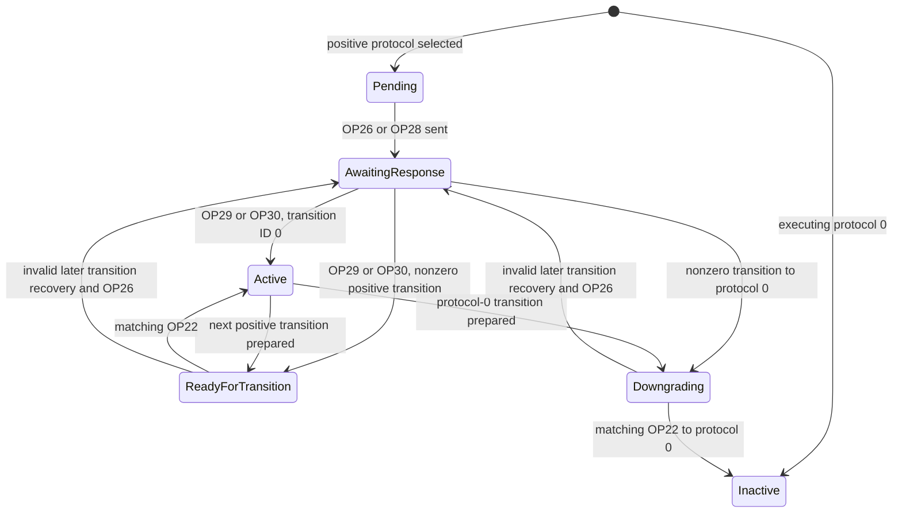
```mermaid
stateDiagram-v2
    [*] --> Inactive: executing protocol 0
    [*] --> Pending: positive protocol selected
    Pending --> AwaitingResponse: OP26 or OP28 sent
    AwaitingResponse --> Active: OP29 or OP30, transition ID 0
    AwaitingResponse --> ReadyForTransition: OP29 or OP30, nonzero positive transition
    AwaitingResponse --> Downgrading: nonzero transition to protocol 0
    Active --> ReadyForTransition: next positive transition prepared
    Active --> Downgrading: protocol-0 transition prepared
    ReadyForTransition --> Active: matching OP22
    Downgrading --> Inactive: matching OP22 to protocol 0
    ReadyForTransition --> AwaitingResponse: invalid later transition recovery and OP26
    Downgrading --> AwaitingResponse: invalid later transition recovery and OP26
```

`ReadyForTransition` and `Downgrading` can both coexist with active old-epoch media. Use the media-readiness properties instead of deriving usability from the enum value.

## Ratchet Overlap

Per-user decryptor objects are reused across epoch changes so their overlap windows survive:

- A transition to protocol `0` enables plaintext passthrough indefinitely and retains old encrypted ratchets for ten seconds.
- A transition back to E2EE allows plaintext for ten seconds and retains previous encrypted-epoch ratchets for ten seconds.
- A newly recognized participant is initialized with the latest prepared receive mode.

These windows allow in-flight media from the previous mode or epoch to be processed during the transition.

## Move and Reconnect Workflow

Moving the bot or changing the voice-server context requires a fresh voice session and DAVE coordinator.

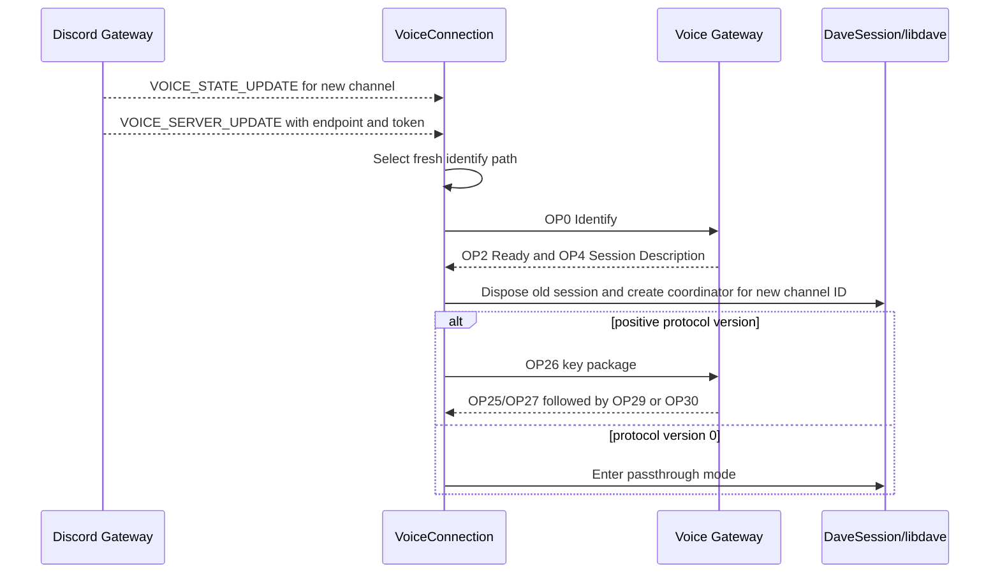
```mermaid
sequenceDiagram
    participant Gateway as Discord Gateway
    participant VC as VoiceConnection
    participant VG as Voice Gateway
    participant DAVE as DaveSession/libdave

    Gateway-->>VC: VOICE_STATE_UPDATE for new channel
    Gateway-->>VC: VOICE_SERVER_UPDATE with endpoint and token
    VC->>VC: Select fresh identify path
    VC->>VG: OP0 Identify
    VG-->>VC: OP2 Ready and OP4 Session Description
    VC->>DAVE: Dispose old session and create coordinator for new channel ID
    alt positive protocol version
        VC->>VG: OP26 key package
        VG-->>VC: OP25/OP27 followed by OP29 or OP30
    else protocol version 0
        VC->>DAVE: Enter passthrough mode
    end
```

The MLS group ID is the voice channel ID. State from the previous endpoint or channel is not reused.

## Playback Decision

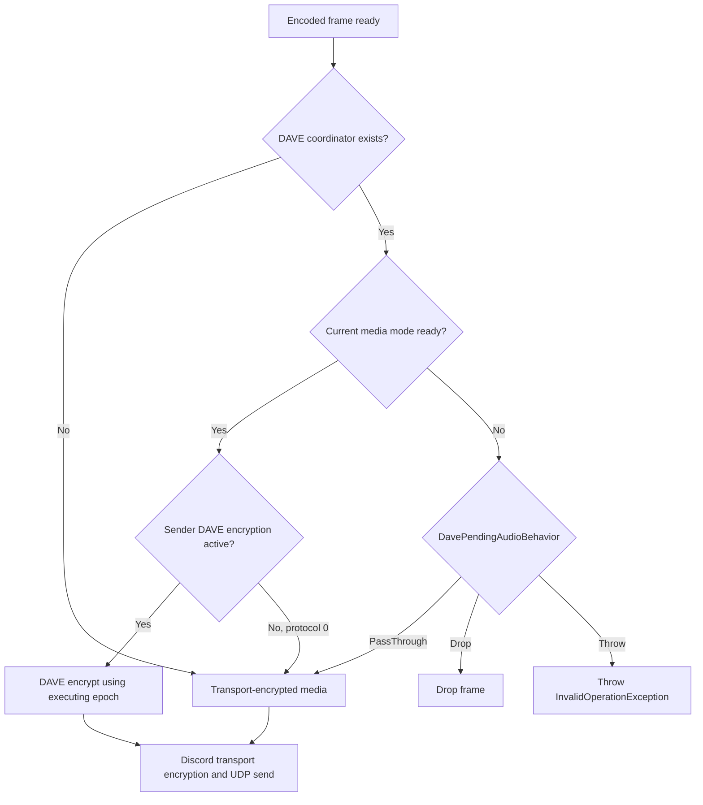
```mermaid
flowchart TD
    Frame["Encoded frame ready"] --> Session{"DAVE coordinator exists?"}
    Session -->|"No"| Plain["Transport-encrypted media"]
    Session -->|"Yes"| Ready{"Current media mode ready?"}
    Ready -->|"Yes"| Active{"Sender DAVE encryption active?"}
    Active -->|"Yes"| E2EE["DAVE encrypt using executing epoch"]
    Active -->|"No, protocol 0"| Plain
    Ready -->|"No"| Policy{"DavePendingAudioBehavior"}
    Policy -->|"PassThrough"| Plain
    Policy -->|"Drop"| Drop["Drop frame"]
    Policy -->|"Throw"| Throw["Throw InvalidOperationException"]
    E2EE --> Transport["Discord transport encryption and UDP send"]
    Plain --> Transport
```

Prepared transitions follow the `Ready → Active` path because the old sender epoch is still usable. Protocol-0 passthrough follows the `Ready → not active` path.

## Audio Output Pipeline

`VoiceOutputController` provides direct Opus passthrough and serialized PCM overlays. Both modes enter the same DAVE-aware packet preparation path:

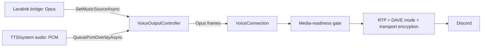
```mermaid
flowchart LR
    Music["Lavalink bridge: Opus"] -->|"SetMusicSourceAsync"| Controller["VoiceOutputController"]
    Overlay["TTS/system audio: PCM"] -->|"QueuePcmOverlayAsync"| Controller
    Controller -->|"Opus frames"| Connection["VoiceConnection"]
    Connection --> Gate["Media-readiness gate"]
    Gate --> Packet["RTP + DAVE mode + transport encryption"]
    Packet --> Discord
```

`VoiceConfiguration.EnableExternalOpus` must be `true` before binding a `VoiceOutputController` or another `IExternalOpusSource`.

See [Audio Output](xref:modules_audio_voice_output) for usage details.

## Runtime Signals

Use these for application-level gating and diagnostics:

- `IsDaveNegotiated`
- `IsDaveActive`
- `IsE2eeUsableForSend`
- `IsE2eeUsableForReceive`
- `DaveProtocolVersion`
- `DaveState`
- `WaitForDaveActiveAsync(...)`
- `DaveStateChanged`
- `DaveOpcodeObserved`
- `EnableDebugLogging`

`WaitForDaveActiveAsync` waits for an encrypting sender transform. It is not a generic media-readiness wait; protocol-0 passthrough is usable but never DAVE-active.

## See Also

- [Discord DAVE Protocol Whitepaper](https://daveprotocol.com/)
- [Voice Overview](xref:modules_audio_voice)
- [Voice Events](xref:modules_audio_voice_events)
- [Voice Prerequisites](xref:modules_audio_voice_prerequisites)
- [Transmitting Audio](xref:modules_audio_voice_transmit)
- [Receiving Audio](xref:modules_audio_voice_receive)
