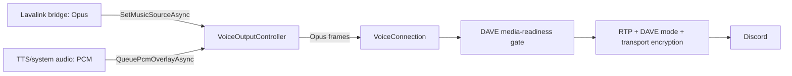

# VoiceOutputController

The @DisCatSharp.Voice.Entities.VoiceOutputController is the recommended way to manage audio output in DisCatSharp.
It implements @DisCatSharp.Voice.Interfaces.IExternalOpusSource and plugs directly into @DisCatSharp.Voice.VoiceConnection.BindExternalOpusSourceAsync*.

Common use cases:

- Stream music from the Lavalink bridge with zero-decode Opus passthrough
- Queue TTS/system audio as PCM overlays that pause or duck music automatically
- Rebind music sources cleanly during playback

## How It Works



The controller operates in three states:

1. **Idle** — no music source bound, no overlays queued; the output channel is quiet.
2. **Opus passthrough** — music source frames are forwarded directly without decode/encode overhead.
3. **Overlay playback** — PCM overlays are encoded and emitted one-at-a-time; music is paused (default) or ducked.

## Quick Start

```csharp
using DisCatSharp.Voice;
using DisCatSharp.Voice.Entities;

client.UseVoice(new VoiceConfiguration
{
    // Required by BindExternalOpusSourceAsync.
    EnableExternalOpus = true
});

// Create the controller (defaults to 48kHz stereo)
await using var controller = new VoiceOutputController();

// Bind to the voice connection
await connection.BindExternalOpusSourceAsync(controller);

// Set the Lavalink bridge as the music source (Opus passthrough)
var bridgeSource = lavalinkSession.GetBridgeOpusSource(guildId);
await controller.SetMusicSourceAsync(bridgeSource);

// Queue a TTS overlay (pauses music while playing)
await controller.QueuePcmOverlayAsync(ttsStream, "tts-greeting");

// Queue an overlay and let the controller dispose the stream when done
await controller.QueueOwnedPcmOverlayAsync(systemSoundStream, "join-chime");
```

> [!IMPORTANT]
> `BindExternalOpusSourceAsync` throws `InvalidOperationException` unless `VoiceConfiguration.EnableExternalOpus` was enabled before the voice connection was created.

## Music Source

Bind or swap the music source at any time with `SetMusicSourceAsync`:

```csharp
// Bind music
await controller.SetMusicSourceAsync(bridgeSource);

// Swap to a different source (old pump is cleanly stopped)
await controller.SetMusicSourceAsync(anotherSource);

// Stop music entirely
await controller.SetMusicSourceAsync(null);
```

The music pump reads `IExternalOpusSource.ReadFramesAsync` on a background task. Frames flow at the source's cadence — no PeriodicTimer master clock is needed.

The controller does not bypass connection security. Pre-encoded frames skip only the internal Opus encoder; `VoiceConnection` still applies media-readiness gating, RTP framing, the currently executing DAVE mode, and Discord transport encryption.

## Overlay Queue

Overlays (TTS, system sounds, etc.) are queued and played **serially**:

```csharp
// Queue PCM overlays (16-bit LE, matching the controller's AudioFormat)
await controller.QueuePcmOverlayAsync(ttsStream, "tts");
await controller.QueuePcmOverlayAsync(chimePcmStream, "chime");

// Auto-dispose the stream when playback finishes
await controller.QueueOwnedPcmOverlayAsync(ownedStream, "alert");
```

While an overlay is active:

- By default, music is **paused** (no decode/re-encode needed — lowest latency)
- Alternatively, set `PauseMusicForOverlays = false` and use `SetDucking(true, 0.2f)` for concurrent playback at reduced volume (requires decode/mix/re-encode)

## Ducking vs. Pausing

```csharp
// Default: music pauses for overlays (recommended)
controller.PauseMusicForOverlays = true;

// Alternative: duck music to 20% volume during overlays
controller.PauseMusicForOverlays = false;
controller.SetDucking(true, 0.20f);

// Restore full volume
controller.SetDucking(false);

// Or set gain directly
controller.MusicGain = 0.5f; // 50% volume (triggers slow decode/encode path)
```

> [!NOTE]
> Music gain values below 1.0 trigger a decode → scale → re-encode path.
> Keep `MusicGain` at 1.0 (the default) for zero-overhead passthrough.

## Lifecycle

```csharp
// 1. Create controller
await using var controller = new VoiceOutputController();

// 2. Bind to voice connection
await connection.BindExternalOpusSourceAsync(controller);

// 3. Use as needed
await controller.SetMusicSourceAsync(source);
await controller.QueuePcmOverlayAsync(stream);

// 4. Dispose (cancels all tasks, releases Opus encoder)
await controller.DisposeAsync();
```

> [!IMPORTANT]
> Only one consumer may call `ReadFramesAsync` at a time (enforced at runtime).
> In practice this means one `BindExternalOpusSourceAsync` call per controller.

## With Lavalink Bridge Mode

```csharp
// Get the raw Opus source from the bridge
var bridgeSource = lavalinkSession.GetBridgeOpusSource(guildId);

// Create controller and set the bridge as music
await using var controller = new VoiceOutputController();
await controller.SetMusicSourceAsync(bridgeSource);

// Rebind the voice connection to use the controller
if (!lavalinkSession.RebindBridgeOpusSource(guildId, controller))
    throw new InvalidOperationException("No bridge voice connection is active for this guild.");

// Now you can overlay TTS while music plays
await controller.QueuePcmOverlayAsync(ttsStream, "tts");
```

## DAVE Transitions

The controller does not need to be rebound during a DAVE epoch change. Both direct Opus music frames and encoded PCM overlays use the same connection-level behavior:

- An established sender continues using its old epoch while the next transition is `ReadyForTransition` or `Downgrading`.
- A matching OP22 switches the local sender to the prepared ratchet or protocol-0 passthrough.
- `DavePendingAudioBehavior` applies only when no executing media mode is usable.

Use `VoiceConnection.IsE2eeUsableForSend` when deciding whether to start or continue output. Use `WaitForDaveActiveAsync` only when the application specifically requires an encrypting DAVE sender; protocol-0 passthrough is usable but never DAVE-active.

## Configuration Reference

### VoiceOutputController

| Property | Type | Default | Description |
|----------|------|---------|-------------|
| `MusicGain` | `float` | `1.0` | Music volume multiplier (0.0–1.0). Values < 1.0 enable the slow decode/encode path. |
| `PauseMusicForOverlays` | `bool` | `true` | When true, music pauses during overlay playback (no mixing overhead). |
| `HasActiveOverlay` | `bool` | — | Read-only. True when one or more overlays are currently playing. |

### Constructor

| Parameter | Type | Default | Description |
|-----------|------|---------|-------------|
| `format` | `AudioFormat` | `AudioFormat.Default` | Audio format for PCM encode/decode (48kHz, 2ch, Music preset) |

---

> [!NOTE]
> The previous `VoiceOutputMixer` and its channel-based API have been removed.
> All new integrations should use `VoiceOutputController`.

## See Also

- [Voice Overview](xref:modules_audio_voice)
- [Transmitting Audio](xref:modules_audio_voice_transmit)
- [Voice Architecture](xref:modules_audio_voice_architecture)
- [Lavalink Voice Bridge](xref:modules_audio_lavalink_v4_bridge)
