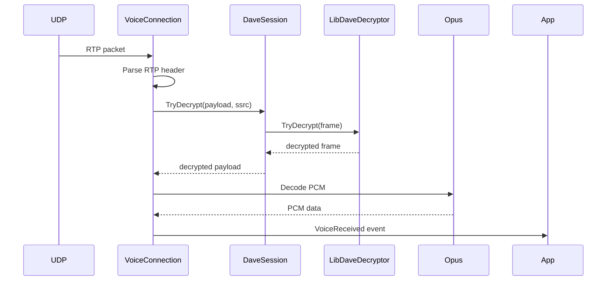

## Receiving with Voice

### Enable Receiver

Receiving incoming audio is disabled by default to save on bandwidth, as most users will never make use of incoming data.
This can be changed by providing a configuration object to `DiscordClient#UseVoice()`.

```cs
var discord = new DiscordClient();

discord.UseVoice(new VoiceConfiguration()
{
    EnableIncoming = true
});
```

### Establish Connection

The voice channel join process is the exact same as when transmitting.

```cs
DiscordChannel channel;
VoiceConnection connection = await channel.ConnectAsync();
```

### Write Event Handler

We'll be able to receive incoming audio from the `VoiceReceived` event fired by `VoiceConnection`.

```cs
connection.VoiceReceived += ReceiveHandler;
```

Writing the logic for this event handler will depend on your overall goal.

The event arguments will contain a PCM audio packet for you to make use of.
You can convert each packet to another format, concatenate them all together, feed them into an external program, or process the packets any way that'll suit your needs.

When a user is speaking, `VoiceReceived` should fire once every twenty milliseconds and its packet will contain around twenty milliseconds worth of audio; this can vary due to differences in client settings.
To help keep track of the torrent of packets for each user, you can use user IDs in combination the synchronization value (SSRC) sent by Discord to determine the source of each packet.

This short-and-simple example will use [ffmpeg](https://ffmpeg.org/about.html) to convert each packet to a _wav_ file.

```cs
private async Task ReceiveHandler(VoiceConnection _, VoiceReceiveEventArgs args)
{
    var name = DateTimeOffset.Now.ToUnixTimeMilliseconds();
    var ffmpeg = Process.Start(new ProcessStartInfo
    {
        FileName = "ffmpeg",
        Arguments = $@"-ac 2 -f s16le -ar 48000 -i pipe:0 -ac 2 -ar 44100 {name}.wav",
        RedirectStandardInput = true
    });

    await ffmpeg.StandardInput.BaseStream.WriteAsync(args.PcmData);
}
```

<br/>
That's really all there is to it. Connect to a voice channel, hook an event, process the data as you see fit.


## DAVE Decryption

When a Discord voice channel has DAVE enabled, DisCatSharp.Voice automatically decrypts every incoming audio packet before passing it to your event handler. No changes to your bot code are needed.

### How It Works

- `DaveSession` maintains a map of SSRC → `LibDaveDecryptor`, one per active sender in the encrypted session.
- When a new MLS epoch is committed (triggered by a user joining or leaving), fresh ratchet keys are installed into each decryptor atomically.
- If no ratchet has been installed yet for a given SSRC (e.g. the bot receives a packet before the MLS handshake completes for that user), the packet is forwarded as-is without DAVE decryption. This gap-tolerance prevents audio dropouts during epoch transitions.
- Late packets arriving after a ratchet rotation may fail AES-128-GCM authentication. This is expected and safe — those packets are silently discarded rather than passed to the Opus decoder.



> [!NOTE]
> The `VoiceReceiveEventArgs.PcmData` your handler receives is always plain PCM — DAVE decryption (if applicable) has already occurred by the time the event fires.

---

## Example Commands

```cs
[Command("start")]
public async Task StartCommand(CommandContext ctx, DiscordChannel channel = null)
{
    channel ??= ctx.Member.VoiceState?.Channel;
    var connection = await channel.ConnectAsync();

    Directory.CreateDirectory("Output");
    connection.VoiceReceived += VoiceReceiveHandler;
}


[Command("stop")]
public Task StopCommand(CommandContext ctx)
{
    var voice = ctx.Client.GetVoice();

    var connection = voice.GetConnection(ctx.Guild);
    connection.VoiceReceived -= VoiceReceiveHandler;
    connection.Dispose();

    return Task.CompletedTask;
}

private async Task VoiceReceiveHandler(VoiceConnection connection, VoiceReceiveEventArgs args)
{
    var fileName = DateTimeOffset.Now.ToUnixTimeMilliseconds();
    var ffmpeg = Process.Start(new ProcessStartInfo
    {
        FileName = "ffmpeg",
        Arguments = $@"-ac 2 -f s16le -ar 48000 -i pipe:0 -ac 2 -ar 44100 Output/{fileName}.wav",
        RedirectStandardInput = true
    });

    await ffmpeg.StandardInput.BaseStream.WriteAsync(args.PcmData);
    ffmpeg.Dispose();
}
```
