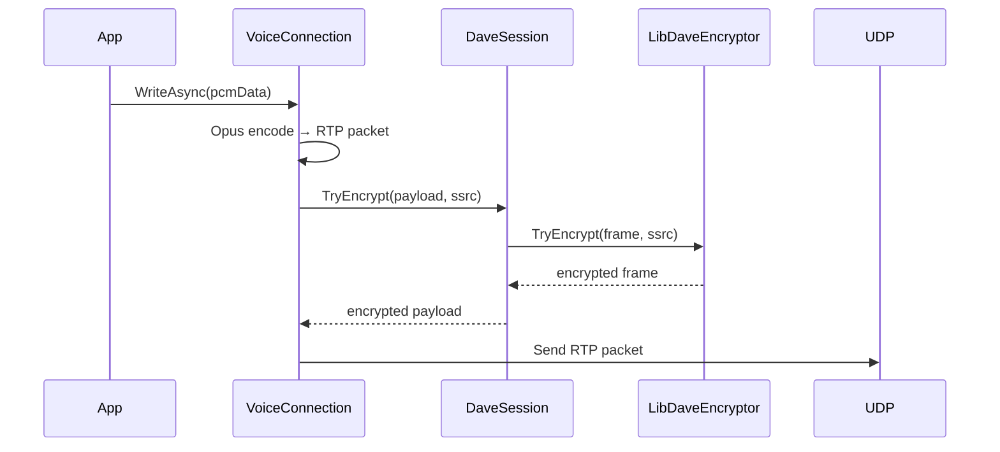

## Transmitting with Voice

### Enable Voice
Install the `DisCatSharp.Voice` package from NuGet.


Then use the `UseVoice` extension method on your instance of `DiscordClient`.
```cs
var discord = new DiscordClient();
discord.UseVoice();
```

### Connect
Joining a voice channel is *very* easy; simply use the `ConnectAsync` extension method on `DiscordChannel`.
```cs
DiscordChannel channel;
VoiceConnection connection = await channel.ConnectAsync();
```

### Transmit
Discord requires that we send Opus encoded stereo PCM audio data at a sample rate of 48,000 Hz.

You'll need to convert your audio source to PCM S16LE using your preferred program for media conversion, then read
that data into a `Stream` object or an array of `byte` to be used with Voice. Opus encoding of the PCM data will
be done automatically by Voice before sending it to Discord.

This example will use [ffmpeg](https://ffmpeg.org/about.html) to convert an MP3 file to a PCM stream.
```cs
var filePath = "funiculi_funicula.mp3";
var ffmpeg = Process.Start(new ProcessStartInfo
{
    FileName = "ffmpeg",
    Arguments = $@"-i ""{filePath}"" -ac 2 -f s16le -ar 48000 pipe:1",
    RedirectStandardOutput = true,
    UseShellExecute = false
});

Stream pcm = ffmpeg.StandardOutput.BaseStream;
```

Now that our audio is the correct format, we'll need to get a *transmit sink* for the channel we're connected to.
You can think of the transmit stream as our direct interface with a voice channel; any data written to one will be
processed by Voice, queued, and sent to Discord which will then be output to the connected voice channel.
```cs
VoiceTransmitSink transmit = connection.GetTransmitSink();
```

Once we have a transmit sink, we can 'play' our audio by copying our PCM data to the transmit sink buffer.
```cs
await pcm.CopyToAsync(transmit);
```
`Stream#CopyToAsync()` will copy PCM data from the input stream to the output sink, up to the sink's configured
capacity, at which point it will wait until it can copy more. This means that the call will hold the task's execution,
until such time that the entire input stream has been consumed, and enqueued in the sink.

This operation cannot be cancelled. If you'd like to have finer control of the playback, you should instead consider
using `Stream#ReadAsync()` and `VoiceTransmitSink#WriteAsync()` to manually copy small portions of PCM data to the
transmit sink.

### Disconnect
Similar to joining, leaving a voice channel is rather straightforward.
```cs
var voice = discord.GetVoice();
var connection = voice.GetConnection();

connection.Disconnect();
```

## DAVE Encryption

When a Discord voice channel has DAVE enabled, DisCatSharp.Voice automatically encrypts every outgoing audio packet using the **DAVE** end-to-end encryption protocol. No changes to your bot code are needed — encryption is fully transparent.

### How It Works

- After connecting, `VoiceConnection` negotiates the DAVE session via the voice gateway. When the MLS group is established, `DaveSession` installs a `LibDaveEncryptor` for the connection.
- Each outgoing RTP frame is passed through `DaveSession.TryEncrypt()` before being dispatched over UDP.
- Encryption uses **AES-128-GCM** with per-frame ratchet keys derived from the current MLS epoch key. The ratchet generation is advanced on every frame to provide forward secrecy.
- The encryptor handles SSRC binding dynamically — if your bot's SSRC changes (e.g. after a reconnect), the encryptor is updated automatically.
- When users join or leave the encrypted channel, a new MLS epoch is committed. The `DaveSession` installs a fresh `LibDaveEncryptor` for the new epoch seamlessly.



> [!NOTE]
> If DAVE is not active (e.g. the channel does not use E2EE, or `libdave` failed to load), packets are sent without the DAVE layer — only the standard Discord transport encryption (XSalsa20-Poly1305) applies. Your code does not need to handle this distinction.

---

## Example Commands
```cs
[Command("join")]
public async Task JoinCommand(CommandContext ctx, DiscordChannel channel = null)
{
    channel ??= ctx.Member.VoiceState?.Channel;
    await channel.ConnectAsync();
}

[Command("play")]
public async Task PlayCommand(CommandContext ctx, string path)
{
    var voice = ctx.Client.GetVoice();
    var connection = voice.GetConnection(ctx.Guild);

    var transmit = connection.GetTransmitSink();

    var pcm = ConvertAudioToPcm(path);
    await pcm.CopyToAsync(transmit);
    await pcm.DisposeAsync();
}

[Command("leave")]
public async Task LeaveCommand(CommandContext ctx)
{
    var voice = ctx.Client.GetVoice();
    var connection = voice.GetConnection(ctx.Guild);

    connection.Disconnect();
}

private Stream ConvertAudioToPcm(string filePath)
{
    var ffmpeg = Process.Start(new ProcessStartInfo
    {
        FileName = "ffmpeg",
        Arguments = $@"-i ""{filePath}"" -ac 2 -f s16le -ar 48000 pipe:1",
        RedirectStandardOutput = true,
        UseShellExecute = false
    });

    return ffmpeg.StandardOutput.BaseStream;
}
```
