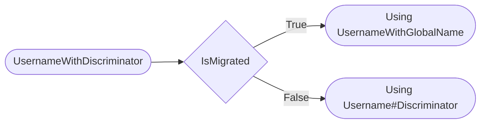

# Upgrade from **10.3.0** to **10.4.0**

 

> [!NOTE]
> DisCatSharp is now compiled with .NET 7.0.

> [!IMPORTANT]
> The namespaces were adjusted to fit the actual location.

---

## What Is New In DisCatSharp?

 

🆕 **Added [DisCatSharp Analyzer](xref:vs) to help you write better code**

🆕 Support for the new [Username System](https://dis.gd/usernames)

🆕 Support for [Linked Roles](https://discord.com/build/linked-roles)

🆕 Support for [Application Subscriptions](https://discord.com/build/apply-now) aka Premium Apps

🆕 Support for [Voice Messages](https://support.discord.com/hc/en-us/articles/13091096725527)

🆕 Support for sending [`@silent`](https://discord.com/blog/discord-update-february-20-2023-changelog#heading-1) messages

🧪 Partial support for role subscriptions

🧪 Partial support for burst reactions

🧪 Partial support for onboarding

🛠️ Fixed a bug where various flag enums were missing the `[Flags]` annotation.

---

## What Changed?

 

### DisCatSharp

#### [DiscordClient](xref:DisCatSharp.DiscordClient)

➕ Added [GenerateInAppOauthFor](xref:DisCatSharp.DiscordClient.GenerateInAppOauthFor*) to generate an oauth link for other apps.

➕ Added [GetCurrentApplicationInfoAsync](xref:DisCatSharp.DiscordClient.GetCurrentApplicationInfoAsync*) to get the current application info.

➕ Added the [GuildAuditLogEntryCreated](xref:DisCatSharp.DiscordClient.GuildAuditLogEntryCreated) to the [DiscordClient](xref:DisCatSharp.DiscordClient). The implementation is currently unstable.

➕ Added `AutoModerationConfiguration` and `AutoModerationExecution` to [DiscordIntent](xref:DisCatSharp.Enums.DiscordIntents). This is included in `AllUnprivileged` and `All`.

➕ Added TryGetPublishedListings to get the published premium sku listings for an application.

⚠️ Removed `GuildBans` from [DiscordIntents](xref:DisCatSharp.Enums.DiscordIntents) and replaced it with `GuildModeration`.

#### [DiscordConfiguration](xref:DisCatSharp.DiscordConfiguration)

⚠️ Deprecated `UseCanary` & `UsePtb`.

➕ Added [ApiChannel](xref:DisCatSharp.DiscordConfiguration.ApiChannel).

`UseCanary` & `UsePtb` temporarily set `ApiChannel` internally:
[!code-csharp]

#### [DiscordApplication](xref:DisCatSharp.Entities.DiscordApplication)

➕ Added [ApproximateGuildCount](xref:DisCatSharp.Entities.DiscordApplication.ApproximateGuildCount) to get the approximate guild count.

➕ Added [InteractionsEndpointUrl](xref:DisCatSharp.Entities.DiscordApplication.InteractionsEndpointUrl) to get the interactions endpoint url set in the developer portal.

➕ Added [RedirectUris](xref:DisCatSharp.Entities.DiscordApplication.RedirectUris) to get the redirect uris set in the developer portal.

➕ Added [Guild](xref:DisCatSharp.Entities.DiscordApplication.Guild) to get the guild this application is linked to as support server.

➕ Added support for application subscriptions. See [this](#application-subscription) for more information.

➕ Added enum [ApplicationCommandContexts](xref:DisCatSharp.Enums.ApplicationCommandContexts). This field isn't ➕ Added for now.

#### [DiscordInteraction](xref:DisCatSharp.Entities.DiscordInteraction)

➕ Added the options `AsSilentMessage` and `SuppressEmbeds` to [DiscordFollowupMessageBuilder](xref:DisCatSharp.Entities.DiscordFollowupMessageBuilder), [DiscordInteractionResponseBuilder](xref:DisCatSharp.Entities.DiscordInteractionResponseBuilder) and [DiscordWebhookBuilder](xref:DisCatSharp.Entities.DiscordWebhookBuilder).

➕ Added [Entitlements](xref:DisCatSharp.Entities.DiscordInteraction.Entitlements) to get the entitlements for premium apps.

➕ Added [InteractionResponseType](xref:DisCatSharp.Enums.InteractionResponseType) `InteractionRequireEntitlement`.

#### [DiscordRole](xref:DisCatSharp.Entities.DiscordRole)

➕ Added [IsLinkedRole](xref:DisCatSharp.Entities.DiscordRoleTags.IsLinkedRole) to [DiscordRole.Tags](xref:DisCatSharp.Entities.DiscordRole.Tags) to check whether this role is a linked role.

➕ Added [SubscriptionListingId](xref:DisCatSharp.Entities.DiscordRoleTags.SubscriptionListingId) to [DiscordRole.Tags](xref:DisCatSharp.Entities.DiscordRole.Tags) to get the subscription listing id.

➕ Added [AvailableForPurchase](xref:DisCatSharp.Entities.DiscordRoleTags.AvailableForPurchase) to [DiscordRole.Tags](xref:DisCatSharp.Entities.DiscordRole.Tags) to check whether this role is available for purchase.

#### [DiscordGuild](xref:DisCatSharp.Entities.DiscordGuild)

➕ Added [SafetyAlertsChannel](xref:DisCatSharp.Entities.DiscordGuild.SafetyAltersChannel) to get the safety alerts channel and the corresponding function [ModifySafetyAlertsSettingsAsync](xref:DisCatSharp.Entities.DiscordGuild.ModifySafetyAlertsSettingsAsync*) to modify the safety alerts settings.

#### [AutomodRule](xref:DisCatSharp.Entities.AutomodRule)

➕ Added [MentionRaidProtectionEnabled](xref:DisCatSharp.Entities.AutomodTriggerMetadata.MentionRaidProtectionEnabled) to [AutomodTriggerMetadata](xref:DisCatSharp.Entities.AutomodTriggerMetadata).

➕ Added `TriggerType` `EnforceServerRules`. This is currently in alpha.

#### [DiscordChannel](xref:DisCatSharp.Entities.DiscordChannel)

➕ Added `scheduledEventId` to [DiscordChannel.OpenStageAsync](xref:DisCatSharp.Entities.DiscordChannel.OpenStageAsync*) to create a stage channel bound to a scheduled event.

➕ Added new [ChannelFlags](xref:DisCatSharp.Enums.ChannelFlags):

-   `IsBroadcasting`
-   `IsRoleSubscriptionTemplatePreviewChannel`
-   `ApplicationShelfConsent`
-   `SummariesDisabled`
-   `IsMediaChannel`
-   `IsScheduledForDeletion`
-   `ClydeAi`
-   `IsGuildResourceChannel`
-   `IsSpam`

⚠️ Removed `privacyLevel` from [DiscordChannel.OpenStageAsync](xref:DisCatSharp.Entities.DiscordChannel.OpenStageAsync*) as it's no longer supported by discord.

#### [DiscordThreadChannel](xref:DisCatSharp.Entities.DiscordThreadChannel)

➕ Added [LockAsync](xref:DisCatSharp.Entities.DiscordThreadChannel.LockAsync*) to lock a thread.

➕ Added [UnlockAsync](xref:DisCatSharp.Entities.DiscordThreadChannel.UnlockAsync*) to unlock a thread.

➕ You can now pin posts in forum channels.

❕ [Thread members](xref:DisCatSharp.Entities.DiscordThreadChannel.GetMembersAsync*) are now paginated.

⚠️ Deprecated parameter `locked` from [ArchiveAsync](xref:DisCatSharp.Entities.DiscordThreadChannel.ArchiveAsync*) as it's no longer supported by discord.

#### [DiscordMessage](xref:DisCatSharp.Entities.DiscordMessage)

➕ Added support for voice messages. Flag `IsVoiceMessage` is set to represented if the message is a voice message.

➕ Added new [MessageTypes](xref:DisCatSharp.Enums.MessageType):

-   `PrivateChannelIntegrationAdded`
-   `PrivateChannelIntegrationRemoved`
-   `PremiumReferral`

#### [DiscordAttachment](xref:DisCatSharp.Entities.DiscordAttachment)

➕ Added [DurationSecs](xref:DisCatSharp.Entities.DiscordAttachment.DurationSecs) to get the duration of a voice message.

➕ Added [WaveForm](xref:DisCatSharp.Entities.DiscordAttachment.WaveForm) to get the waveform of a voice message. This is a base64 encoded byte-array representing a sampled waveform.

#### [DiscordReaction](xref:DisCatSharp.Entities.DiscordReaction)

> [!WARNING]
> Reactions are undergoing a rework which is not covered in this release.

🧪 Partial support for burst reactions.

#### [DiscordUser](xref:DisCatSharp.Entities.DiscordUser)

➕ Added [CreateDmChannelAsync](xref:DisCatSharp.Entities.DiscordUser.CreateDmChannelAsync*) to create a dm channel with this user.

➕ Added [SendMessageAsync](xref:DisCatSharp.Entities.DiscordUser.SendMessageAsync*) to send a message to this user.

➕ Added `Collaborator` and `RestrictedCollaborator` to [UserFlags](xref:DisCatSharp.Entities.DiscordUser.Flags) to check whether this user is a collaborator.

➕ Added support for the new [Username System](https://dis.gd/usernames). See [this](#username-system-change) for more information.

➕ Added [GlobalName](xref:DisCatSharp.Entities.DiscordUser.GlobalName) to get the global name of this user.

➕ Added [UsernameWithGlobalName](xref:DisCatSharp.Entities.DiscordUser.UsernameWithGlobalName) to get the username with the global name of this user.

➕ Added [IsMigrated](xref:DisCatSharp.Entities.DiscordUser.IsMigrated) to check whether this user is migrated to the new [Username System](https://dis.gd/usernames).

🛠️ Fixed a bug causing `Locale` to be null.

⚠️ Deprecated [UsernameWithDiscriminator](xref:DisCatSharp.Entities.DiscordUser.UsernameWithDiscriminator).

⚠️ Deprecated [Discriminator](xref:DisCatSharp.Entities.DiscordUser.Discriminator).

#### [DiscordMember](xref:DisCatSharp.Entities.DiscordMember)

➕ Added method [VerifyAsync](xref:DisCatSharp.Entities.DiscordMember.VerifyAsync*) to verify a member. This skips the verification requirements when onboarding is enabled.

➕ Added method [UnverifyAsync](xref:DisCatSharp.Entities.DiscordMember.UnverifyAsync*) to unverify a member.

➕ Added new [MemberFlags](xref:DisCatSharp.Enums.MemberFlags):

-   `BypassesVerification`
-   `StartedOnboarding`
-   `CompletedOnboarding`
-   `IsGuest`
-   `StartedHomeActions`
-   `CompletedHomeActions`
-   `AutomodQuarantinedUsernameOrGuildNickname`
-   `AutomodQuarantinedBio`

#### [DiscordInvite](xref:DisCatSharp.Entities.DiscordInvite)

➕ Added new [TargetType](xref:DisCatSharp.Enums.TargetType)s.

➕ Added new [InviteFlags](xref:DisCatSharp.Enums.InviteFlags).

#### [Permissions](xref:DisCatSharp.Enums.Permissions)

➕ Added `CreateGuildExpressions`

➕ Added `CreateEvents`

➕ Added `UseSoundboard`

➕ Added `UseExternalSounds`

➕ Added `SendVoiceMessages`

⚠️ Renamed `ManageExpressions` to `ManageGuildExpressions`

⚠️ Removed `ManageEmojisAndStickers`

#### [Formatter](xref:DisCatSharp.Formatter)

🛠️ All methods are now extension methods.

➕ Added support for extended markdown.

### DisCatSharp.ApplicationCommands

➕ You can now register guild commands via assembly. This doesn't support translations tho.

➕ Added [Entitlements](xref:DisCatSharp.ApplicationCommands.Context.BaseContext.Entitlements) to BaseContext.

➕ Added support for application subscriptions.

➕ Added ApplicationCommandRequireEntitlementAttribute to require an entitlement to execute a command.

🛠️ Fixed a bug preventing you to set `DmPermission` for ContextMenu commands.

### DisCatSharp.VoiceNext

🛠️ Fixed the ip discovery used to connect to discord voice servers.

Discord changed this suddenly without heads up.

Thanks to [disgo](https://github.com/disgoorg/disgo/) for helping out.

---

## Username System Change

 

### [Preamble](#tab/username-sys-pre)

Official resources:

-   https://dis.gd/usernames
-   https://dis.gd/app-usernames
-   https://discord.com/blog/usernames

### [The Discord Announcement](#tab/username-sys-discord)

#### Impact of Unique Usernames on Apps and Bots

Discord announced that Discord’s username system is changing. Discriminators are being removed and new, unique usernames (`@name`) and display names are being introduced. These changes will make it easier for users to connect with their friends and give more control over identity on Discord. You can visit https://discord.com/blog/usernames to hear from one of their founders about why usernames are changing, or read more details about how changes to the username system affects non-bot users at https://dis.gd/usernames.

#### More details for developers (including an FAQ) are in the Help Center article:

-   https://dis.gd/app-usernames

Below is an overview of how apps and bots will be affected by the username change. More details for developers, including exact dates, will be communicated soon.

#### Changes to bot users on Discord

1. They recently made a change to add bot users to all newly-created apps. During the username migration, all apps without a bot user created before April 14 will have a bot user automatically added. If your app doesn’t require a bot user, you can skip adding the `bot` scope during installation.

2. After migration, developers will no longer be able to directly set bot usernames or bot icons. The bot user’s icon will _always_ be the same as the App Icon. Bot usernames will be determined differently for verified and unverified apps:

-   **Verified apps**: Bot usernames will be determined by the Application Name. When an unverified app goes through the verification process, a username created from the Application Name will be given to the bot user.
-   **Unverified apps**: Bot usernames will be randomized for new and existing unverified apps. This does not affect the Application Name.

3. Application Names (the `Name` field on the **General Overview** page within the app’s settings) will be used as the Display Name for an app’s bot user. This means developers cannot manually update the Display Name for a bot user without updating the Application Name. Server nicknames are unaffected by this change.

4. The Discord client will be updated to only display Application Names in most surfaces, including the bot profile and in the search interface. The client changes will allow all Discord apps, verified and unverified, to use their Application Name as the identity for their app (and bot) across Discord.

#### Migration of verified app usernames

Most verified apps with Application Names which can be automatically migrated to the new username system have been reserved. No user will be able to claim the reserved username, and during migration the reserved name will be automatically given to the app's bot user.

Verified apps that cannot be automatically migrated or wish to change their Application Name for another reason will be able to make a one-time change at the time of migration.

#### Identifying migrated users

To keep clients backwards-compatible, users that are migrated to the new username system will have a single zero (`#0`) discriminator. This will not appear in the client, but will be in payloads your app receives. After the migration to the new username system is complete, the `0` discriminator will be removed.

#### Preparing your app for username changes

-   Remove any logic that depends on discriminators for Discord users. Apps should continue using user IDs to uniquely identify Discord users in their code. Make sure to account for the temporary `#0` discriminator that updated users will have when updating your code.
-   Be prepared for your username change. That includes in code, or anywhere else you may reference your bot username.
-   If your app is verified, stay tuned for details about migration dates and how to perform a one-time update for your Application Name/bot username.

### [DisCatSharps Info](#tab/username-sys-discatsharp)

#### Developer take on the username change for bots

Bots having `Username#Discrim` is pretty useless imo.
`Username#Discrim`s only purpose is to add friends, but you can't add bots as friends.

A single `@username` makes more sense for bots because it acts as a vanity identifier.

Now you could argue about the fact that non-verified bots usernames are randomized.
That might be true, but users see the application name anyways in the UI, and this field is changeable.
Upon verification you can choose your custom `@username`.

I think this helps fighting scams and impersionations even more.

#### Transition to global name

We've deprecated `Discriminator` & `DiscriminatorInt` on the [DiscordUser](xref:DisCatSharp.Entities.DiscordUser) & [DiscordMember](xref:DisCatSharp.Entities.DiscordMember) entities.

Due to global name not being rolled out yet, `GlobalName` is marked as experimental for now.

During the rollout we'll remove the experimental mark from `GlobalName`.

You should update to this new field as soon as possible when the rollout begins.

As an example how to handle both cases:

[!code-csharp]

#### New, changed and deprecated fields

These changes apply both for [DiscordUser](xref:DisCatSharp.Entities.DiscordUser) & [DiscordMember](xref:DisCatSharp.Entities.DiscordMember).

| Change Type | Field or Function         | Type            | Change Description                                                                     |
| ----------- | ------------------------- | --------------- | -------------------------------------------------------------------------------------- |
| Deprecated  | Discriminator             | @System.String  |                                                                                        |
| Deprecated  | DiscriminatorInt          | @System.Int32   |                                                                                        |
| Deprecated  | UsernameWithDiscriminator | @System.String  | This falls back to `UsernameWithGlobalName` for a while if a user is already migrated. |
| Added       | UsernameWithGlobalName    | @System.String  |                                                                                        |
| Added       | GlobalName                | @System.String  |                                                                                        |
| Added       | IsMigrated                | @System.Boolean | Helper function to detect whether a user has is enrolled in the new system.            |
| Changed     | ToString()\*              | @System.String  | Function was updated to return the correct info based on `IsMigrated`                  |

\*This was also changed for [DiscordTeamMember.ToString()](xref:DisCatSharp.Entities.DiscordTeamMember.ToString)

#### Automatic Mapping

To help you transition to this change, we automatically map the old username with discriminator to the new username with global name.

---

---

## Application Subscription

 

### [Preamble](#tab/appsub-pre)

We would like to announce that we have added partial support for Discord's Premium Apps feature. However, please note that this feature is currently in alpha and may not be fully supported by our library as library developers don't get access to the documentation for it.

Premium Apps allow developers to provide premium commands for which users can subscribe via in-app purchases. If a user is not subscribed, bots will respond with a message asking them to subscribe. If they are subscribed, the command payload from Discord to the bot will have a SKU ID set, indicating that the user or server is subscribed.

Although our library has implemented support for this feature, you might need to make adjustments to your code to fully utilize it. If you encounter any issues or require assistance, please inform us so that we can address the issue within the library.

### [Premium Apps](#tab/appsub-pa)

### [Implementation](#tab/appsub-impl)

#### DisCatSharp

We've added the field [Entitlements](xref:DisCatSharp.Entities.DiscordInteraction.Entitlements) to get the entitlements for premium apps.
It is a list of sku ids.

[InteractionResponseType](xref:DisCatSharp.Enums.InteractionResponseType) was extended by type `10` called `InteractionRequireEntitlement`. This is used to tell Discord that the user is not entitled to use the command and requests the user to buy the premium subscription.

Additionally we've added the function TryGetPublishedListings to get the published premium sku listings for an application.
You can use it to check dynamically for your sku ids.

#### DisCatSharp.ApplicationCommands

Application commands got a new @System.Attribute called ApplicationCommandRequireEntitlementAttribute to require an entitlement to execute a command.

BaseContext now has the field [Entitlements](xref:DisCatSharp.ApplicationCommands.Context.BaseContext.Entitlements).

---

---

## Pull Requests

-   [feat: Paginated thread members](https://github.com/Aiko-IT-Systems/DisCatSharp/pull/253)
-   [feat: Add guild audit log entry create event](https://github.com/Aiko-IT-Systems/DisCatSharp/pull/256)
-   [fix: ip discovery](https://github.com/Aiko-IT-Systems/DisCatSharp/pull/274)
-   [feat: Application rework](https://github.com/Aiko-IT-Systems/DisCatSharp/pull/275)
-   [fix: speaking is flags not bool](https://github.com/Aiko-IT-Systems/DisCatSharp/pull/276)
-   [fix(readme): minor grammar mistake](https://github.com/Aiko-IT-Systems/DisCatSharp/pull/280)
-   [fix: DiscordEmoji operator == add compare name](https://github.com/Aiko-IT-Systems/DisCatSharp/pull/284)
-   [DisCatSharp v10.4.0 Stable Release](https://github.com/Aiko-IT-Systems/DisCatSharp/pull/295)

[Full Changes](https://github.com/Aiko-IT-Systems/DisCatSharp/compare/v10.3.2...v10.4.0)

---

## Contributors

-   [JustaSqu1d](https://github.com/JustaSqu1d)
-   [tonnac](https://github.com/tonnac)
-   [Lulalaby](https://github.com/Lulalaby)
-   [TheXorog](https://github.com/TheXorog)
-   [TopiSenpai](https://github.com/TopiSenpai)
-   [quinchs](https://github.com/quinchs)
-   [JuliaJJ](https://github.com/JuliaJJ/)

---

## Special Thanks

This release special thanks go to:

-   [snek](https://github.com/devsnek) for helping out with details about the premium apps implementation 😝
-   [TopiSenpai](https://github.com/TopiSenpai) for helping out with fixing the ip discovery
-   [quinchs](https://github.com/quinchs) for advising a good change I (Lala) totally forgot about
-   [JuliaJJ](https://github.com/JuliaJJ/) for helping out with design choice

---
